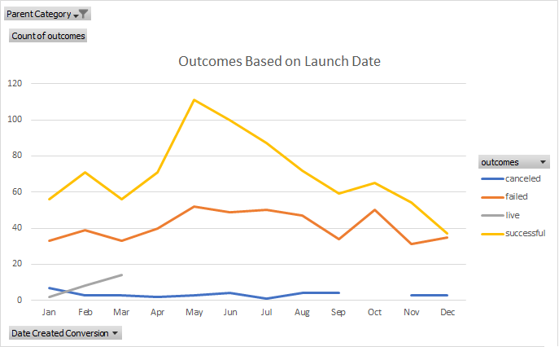

# An Analysis of Kickstarter Campaigns
Performing analysis on Kickstarter data to uncover trends.
This project was an analysis conducted to understand the success and failures of kickstarter campaigns using publicly available data. 
While performing this analysis, the focus centered around theater campaigns on the website. We found that theater campaigns in Great Britain were more successful than US based campaigns. While the US had more campaigns (912), they had a 58% success rate comapred to Great Britains 72% success rate with 359 campaigns. 
---

---
As seen in the boxplot above, there is a large range in the boxplots for goals, but a much smaller one with the ammounts pledged. These varying spreads signify the difficulty that many people experience when raising money on kickstarter compared to their goals. Given that the bottom quartile on the pledged boxplot is on the x-axis, we can see that many kickstarter campaigns do not raise any money. The mean goal of successful campaigns is $5,049 compared to $10,554 with medians at $3,000 and $5,000 respectively. Given the very high Standard deviations of these ($7,749 and $21,968 respectively), we do not think the mean is very relevant due to large outliers. However, the median still shows that campaigns with larger goals tend to perform worse. 
---

---
When looking at the above stacked cluster column chart, you can see that theater campaigns are very popular on Kickstarter and are fairly successful. These are clearly the most popular campaigns to be run on Kickstarter.
---

---
The above picture shows that the time of year that a Theater campaign is launched in has a impact on the success of the campaign. The image clearly shows that campaigns launched in May are the most successful followed by the months June and July. Using this data, it would be reccomended to launch theater campaigns in the early summer when they have the highest likelihood of success. It's highly reccomended that campaigns not be launched in December as the chances of success are almost the same as failure. 
