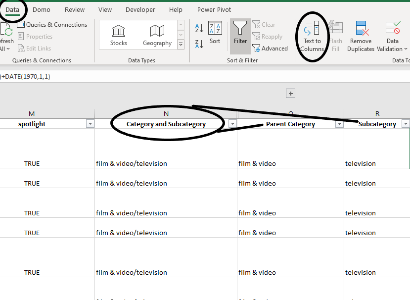
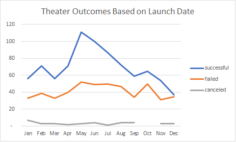
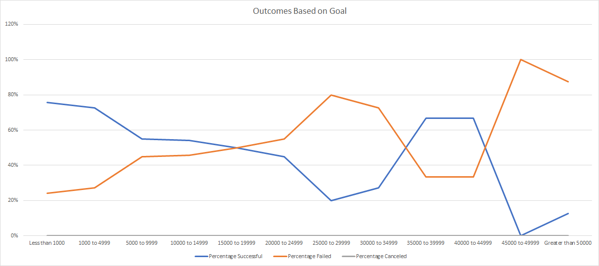

# Kickstarting with Excel

## Overview of Project
Louise has launched a campaign on Kickstarter to raise money for her play "Fever". She came close to her fundraising goal in a short amount of time and would like to know how she fared compared to other campagins. She pulled kickstarter data to understand the differences between her campaign and others.

### Purpose
The purpose of this analysis is to understand how successful Louise was in her campaign compared to other play projects based on the launch date of the campaign and the goal for amount raised. 

## Analysis and Challenges
When looking at the data, there are few things that come to mind immediately.The first of which is that the Category and Subcategory are in the same column. This creates issues because it does not allow you to fully understand the outcomes of campaigns focused on Plays. To solve this problem, I used the "Text to Columns" button under the data ribbon. This allowed to separate the categories and subcategories.The next issue we encounted was that the dates were in Linux form, which is a format that does not allow a normal eye to understand. To solve this issue we used the following formula: =(((J2/60)/60)/24)+DATE(1970,1,1). This gave us useful dates that we could then use to analyze. Once these minor issues were solved, we were able to pivot the data and create charts to visualize the outcomes of campaigns for plays. 

### Analysis of Outcomes Based on Launch Date
Looking at the chart for "Theater Outcomes Based on Launch Date", we can see that most campaigns (167) are launched in May. Coincidentally, this also the month with the highest success rate of 67%. June follows the May as the second most prevelant (153) and successful (65%). 

### Analysis of Outcomes Based on Goals
When Looking at the "Outcomes Based on Goals", one can quickly see that the lower the amount raised, the more likely that a campaign will be successful. The most common ammount raised is in the $1000 to $5000 range where there were 534 campaigns with a 73% success rate. In the dataset, there are not any plays that were cancelled for any amount, which is interesting because there are in other categories.

### Challenges and Difficulties Encountered
Some difficulties that could arise with this dataset are that there are many different years in the dataset and there can be different outcomes based on year. There are forces always happening in any given year like economical, political, etc. that could effect any given month in a certain year.

## Results

- What are two conclusions you can draw about the Outcomes based on Launch Date?
From the "Outcomes Based on Launch Date" chart, you can conclude that the summer months are the most popular and succesful time of year to launch a campaign for plays. Secondly, you can conclude that are very small amount of campaigns are cancelled any time of year so they are either succesful or fail. 

- What can you conclude about the Outcomes based on Goals?
Looking at the "Outcomes Based on Goals", you can conclude quickly that the amount of money raised is directly correlated to the chance of succesful for any given campaign with lower amount raised being much more succesful.

- What are some limitations of this dataset?
The biggest limitation of this dataset is that there are less datapoints for campaigns with higher goals and thus may be skewed in the short term due to lack of datapoints. Another area of concern is that these are not all in the same currency and thus could be skewing the goals and amount raised to real terms.

- What are some other possible tables and/or graphs that we could create?
Some other tables or graphs that could be created are based on the bar graphs based on country to understand how succesful different countries are, a graph that shows the average donation per month to understand the appetite for giving, and a line graph based on deadline instead of start date.
